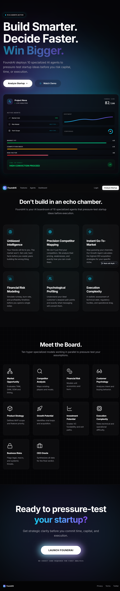
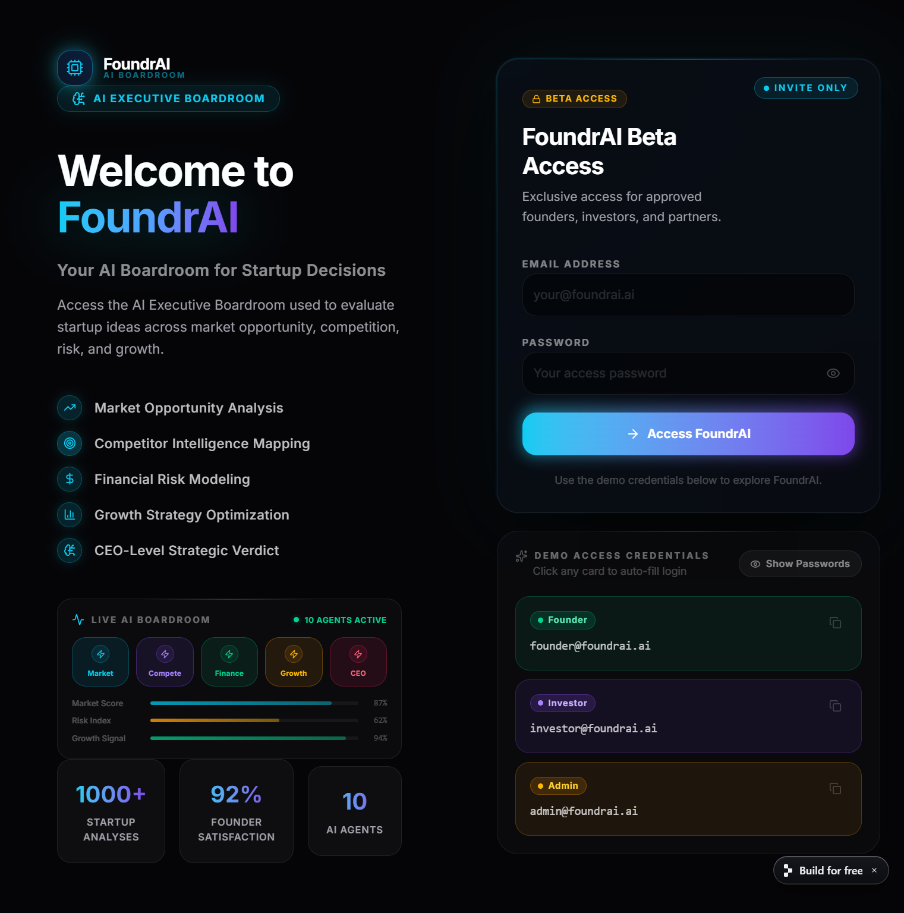
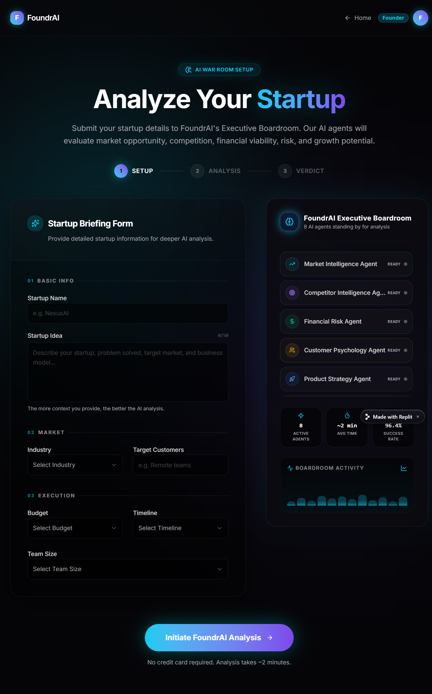
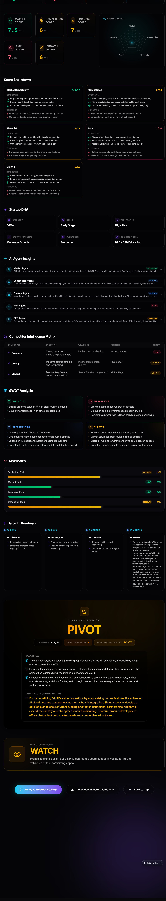

# FoundrAI — AI Executive Boardroom for Startup Validation 🚀

<p align="center">
  <h3 align="center">Build Smarter. Decide Faster. Win Bigger.</h3>
</p>

<p align="center">
FoundrAI is an AI-powered executive boardroom that helps founders validate startup ideas before investing time, money, and execution effort.
</p>

---

# 🌐 Live Demo

### Deployed App
https://foundr-ai--vanamsaicharan2.replit.app/

### GitHub Repository
https://github.com/sainadhkari/FoundrAI

---

# 📌 Problem Statement

90% of startups fail because founders build before properly validating.

Major reasons include:
- Poor market demand
- Weak product-market fit
- Strong competition
- Financial miscalculation
- Bad execution strategy

FoundrAI solves this problem using an AI-powered Executive Boardroom made of specialized AI agents that pressure-test startup ideas before founders commit serious resources.

---

# 🎯 Who Uses FoundrAI?

- Startup Founders
- Investors
- Product Managers
- Venture Studios
- Incubators
- Accelerators

---

# ✨ Key Features

✅ Authentication System  
✅ AI Executive Boardroom  
✅ Startup Validation Engine  
✅ Multi-Agent Analysis  
✅ Market Opportunity Analysis  
✅ Competitor Intelligence Matrix  
✅ Financial Risk Modeling  
✅ SWOT Analysis  
✅ Risk Matrix  
✅ Growth Roadmap  
✅ Final CEO Verdict  
✅ Investor PDF Report Download  

---

# 🧠 AI Agents

FoundrAI uses **8 specialized AI agents**.

---

## 1. Market Intelligence Agent
Analyzes:
- Market opportunity
- TAM
- Industry demand
- Growth potential

---

## 2. Competitor Intelligence Agent
Analyzes:
- Competitors
- Market saturation
- Positioning
- Competitive threats

---

## 3. Financial Risk Agent
Analyzes:
- Budget
- Burn rate
- Runway
- Profitability

---

## 4. Customer Psychology Agent
Analyzes:
- Pain points
- User demand
- Buying behavior

---

## 5. Product Strategy Agent
Analyzes:
- Product-market fit
- Product roadmap
- Differentiation

---

## 6. Growth Strategy Agent
Analyzes:
- GTM strategy
- Acquisition channels
- Scaling potential

---

## 7. Risk Assessment Agent
Analyzes:
- Technical risks
- Financial risks
- Market risks
- Execution risks

---

## 8. Chief Executive AI
Synthesizes all reports and gives final verdict:

- Proceed ✅
- Pivot ⚠️
- Watch 👀
- Reject ❌

---

# 🏗 Architecture

```bash
Frontend (React + Tailwind)
      ↓
Backend (FastAPI)
      ↓
CrewAI Multi-Agent System
      ↓
OpenAI API
      ↓
Final Strategic Decision
```

---

# 🔍 RAG (Retrieval-Augmented Generation)

FoundrAI uses lightweight RAG to improve reasoning quality.

### Knowledge Sources
- Market intelligence reports
- Competitor research
- Industry trend reports
- Startup ecosystem data
- External business intelligence

Benefits:
- Better grounding
- Reduced hallucinations
- More accurate recommendations
- Higher quality reasoning

---

# 🤖 Why Multi-Agent Instead of Single Prompt?

Startup validation is complex.

A single prompt cannot deeply reason across:
- Market
- Competition
- Finance
- Customer psychology
- Product strategy
- Growth
- Risk

Multi-agent architecture enables domain-specialist reasoning, producing more accurate and strategic outputs.

---

# 🛠 Tech Stack

## Frontend
- React
- TypeScript
- Tailwind CSS
- Vite

## Backend
- FastAPI
- Python

## AI Framework
- CrewAI

## LLM
- OpenAI API

## Deployment
- Replit

---

# 📷 Screenshots

## Landing Page


---

## Authentication Page


---

## Startup Analysis Page


---

## Dashboard Overview


---

## Dashboard Analysis



---

# 🔐 Demo Credentials

Use demo credentials to access FoundrAI.

---

## Founder Access
Email: founder@foundrai.ai  
Password: founder123  

---

## Investor Access
Email: investor@foundrai.ai  
Password: investor123  

---

## Admin Access
Email: admin@foundrai.ai  
Password: admin123  

---

# 🧪 Example Startup Input

Use this sample startup idea for testing.

---

## Startup Name
EduAI

## Startup Idea
AI-powered personalized learning platform for colleges using adaptive learning and predictive analytics.

## Industry
EdTech

## Target Customers
Universities, colleges, and educational institutions

## Budget
$100K–$250K

## Timeline
6–12 months

## Team Size
5–10

---

# 📊 Output Includes

FoundrAI generates:

- Market Score
- Competition Score
- Financial Score
- Risk Score
- Growth Score
- SWOT Analysis
- Startup DNA
- Competitor Intelligence Matrix
- Risk Matrix
- Growth Roadmap
- Final CEO Verdict

---

# 🚀 Local Setup

Clone repository:

```bash
git clone https://github.com/sainadhkari/FoundrAI.git
```

Enter project:

```bash
cd FoundrAI
```

Install frontend dependencies:

```bash
npm install
npm run dev
```

Install backend dependencies:

```bash
pip install -r requirements.txt
uvicorn main:app --reload
```

---

# 📈 Future Improvements

- Full RAG with vector database
- Startup comparison engine
- Investor dashboard
- Industry-specific AI models
- Historical analytics
- Advanced forecasting

---

# 👨‍💻 Team

Built for Hackathon 🚀

Team FoundrAI

---

# ⭐ Vision

FoundrAI aims to become the AI-powered operating system for startup validation.

Instead of founders guessing what to build, FoundrAI helps them build with confidence.
