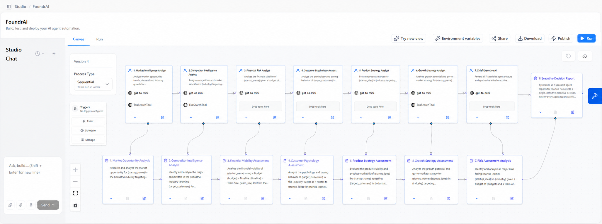

# FoundrAI — AI Executive Boardroom for Startup Validation 🚀

<p align="center">
<h2 align="center">Build Smarter. Decide Faster. Win Bigger.</h2>

AI-powered executive boardroom that validates startup ideas before founders invest time, money and execution effort.
</p>

---

# 🌐 Live Demo

### 🚀 Live Application
https://foundr-ai--vanamsaicharan2.replit.app/

### 📂 GitHub Repository
https://github.com/sainadhkari/FoundrAI

---

# 📌 Problem Statement

More than 90% of startups fail because founders build products before validating market demand, competition, financial viability, execution complexity, and customer demand.

FoundrAI solves this problem by simulating an **AI Executive Boardroom** where multiple specialized AI agents independently evaluate a startup idea and produce an investor-grade strategic report before a founder commits resources.

---

# 🎯 Target Users

- Startup Founders
- Angel Investors
- Venture Capital Firms
- Incubators
- Accelerators
- Product Managers
- Innovation Teams

---

# 🧠 CrewAI Multi-Agent Workflow

FoundrAI is powered by **CrewAI Studio** where every AI agent specializes in one business domain.

The workflow executes sequentially.

1. Market Intelligence Analyst
2. Competitor Intelligence Analyst
3. Financial Risk Analyst
4. Customer Psychology Analyst
5. Product Strategy Analyst
6. Growth Strategy Analyst
7. Chief Executive AI
8. Executive Decision Report

Each specialist agent performs independent reasoning before the Chief Executive AI synthesizes all findings into a single executive boardroom decision.



---

# 🏗 System Architecture

```text
                    User
                      │
                      ▼
         React + TypeScript Frontend
                      │
                      ▼
             FastAPI Backend API
                      │
                      ▼
              CrewAI Orchestrator
                      │
      ┌──────────┬──────────┬──────────┐
      ▼          ▼          ▼          ▼
 Market AI   Competitor   Finance   Customer
                      │
                      ▼
              Product Strategy
                      │
                      ▼
              Growth Strategy
                      │
                      ▼
             Risk Assessment
                      │
                      ▼
             Chief Executive AI
                      │
                      ▼
         Executive Decision Report
                      │
                      ▼
     Interactive Dashboard + PDF Report
```

---

# ✨ Features

- Secure Authentication System
- AI Executive Boardroom
- Multi-Agent Startup Validation
- Market Opportunity Analysis
- Competitor Intelligence
- Financial Risk Modeling
- Customer Psychology Analysis
- Product Strategy Evaluation
- Growth Strategy Planning
- SWOT Analysis
- Startup DNA Classification
- Risk Matrix
- Growth Roadmap
- Interactive Dashboard
- CEO Final Verdict
- Investor PDF Report

---

# 🤖 AI Agents

## 1️⃣ Market Intelligence Agent
Analyzes:
- TAM
- Market demand
- Industry trends
- Growth opportunity

---

## 2️⃣ Competitor Intelligence Agent
Analyzes:
- Competitor landscape
- Market saturation
- Positioning
- Competitive threats

---

## 3️⃣ Financial Risk Agent
Analyzes:
- Budget
- Burn rate
- Runway
- Financial sustainability

---

## 4️⃣ Customer Psychology Agent
Analyzes:
- Customer pain points
- Buying behavior
- User demand
- Adoption likelihood

---

## 5️⃣ Product Strategy Agent
Analyzes:
- Product-market fit
- Feature prioritization
- Differentiation
- Product roadmap

---

## 6️⃣ Growth Strategy Agent
Analyzes:
- Go-to-market strategy
- User acquisition
- Scaling opportunities

---

## 7️⃣ Risk Assessment Agent
Analyzes:
- Technical risk
- Financial risk
- Market risk
- Execution complexity

---

## 8️⃣ Chief Executive AI
Synthesizes every specialist report and generates the final boardroom verdict.

Possible Verdicts

- ✅ Proceed
- ⚠️ Pivot
- 👀 Watch
- ❌ Reject

---

# 🔍 Retrieval-Augmented Generation (RAG)

FoundrAI incorporates a lightweight Retrieval-Augmented Generation approach to improve decision quality.

Knowledge sources include:

- Market intelligence
- Industry reports
- Competitor research
- Business intelligence
- Startup ecosystem information

Benefits

- Better grounding
- Reduced hallucination
- More reliable recommendations
- Higher reasoning quality

---

# 🤔 Why Multi-Agent Instead of One Prompt?

Startup validation spans multiple domains.

Instead of asking one LLM to reason about everything simultaneously, FoundrAI assigns each domain to a specialist AI.

Advantages:

- Better domain expertise
- Parallel reasoning
- Modular architecture
- Easier scalability
- Higher quality recommendations

---

# 🛠 Tech Stack

### Frontend
- React
- TypeScript
- Tailwind CSS
- Vite

### Backend
- FastAPI
- Python

### AI Framework
- CrewAI

### LLM
- OpenAI API

### Deployment
- Replit

---

# 📷 Application Screenshots

## Landing Page


---

## Authentication


---

## Startup Analysis Form


---

## Detailed Strategic Report


---

# 🔐 Demo Credentials

## Founder

Email:
founder@foundrai.ai

Password:
founder123

---

## Investor

Email:
investor@foundrai.ai

Password:
investor123

---

## Admin

Email:
admin@foundrai.ai

Password:
admin123

---

# 🧪 Example Startup

Startup Name

EduAI

Startup Idea

AI-powered personalized learning platform that helps colleges improve student performance using adaptive learning and predictive analytics.

Industry

EdTech

Target Customers

Universities, Colleges, Educational Institutions

Budget

$100K–$250K

Timeline

6–12 Months

Team Size

5–10 Members

---

# 📊 Output Includes

FoundrAI generates

- Executive Scorecard
- Market Score
- Competition Score
- Financial Score
- Risk Score
- Growth Score
- Startup DNA
- SWOT Analysis
- Competitor Matrix
- Risk Matrix
- Growth Roadmap
- AI Agent Insights
- CEO Verdict
- Investor Recommendation
- Downloadable PDF Report

---

# 🚀 Local Setup

Clone repository

```bash
git clone https://github.com/sainadhkari/FoundrAI.git
```

Install dependencies

```bash
npm install
```

Run frontend

```bash
npm run dev
```

Run backend

```bash
pip install -r requirements.txt
uvicorn main:app --reload
```

---

# 📈 Future Roadmap

- Vector Database Integration
- Advanced RAG Pipeline
- Startup Comparison Dashboard
- Industry-Specific AI Models
- Investor Workspace
- Historical Startup Analytics
- Collaborative Team Analysis

---

# 👨‍💻 Team

**Sainadh Kari**

- AI Engineering
- Backend Development
- CrewAI Integration

**Saicharan Vanam**

- Frontend Development
- UI/UX Design
- Dashboard Experience

---

# 🙏 Acknowledgements

- CrewAI
- OpenAI
- React
- FastAPI
- Tailwind CSS
- Replit

---

# ⭐ Vision

Our vision is to make startup validation as accessible as writing a business idea.

Instead of founders relying on intuition alone, FoundrAI enables evidence-based decision-making through a collaborative AI executive boardroom.
